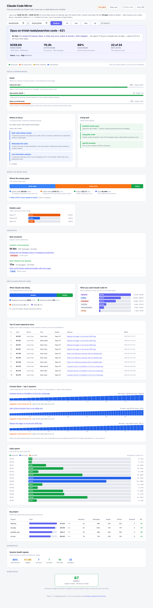

# Claude Code Mirror

A single-file tool that reads your local Claude Code session logs and shows you how you actually use the tool — spending, token distribution, where context bloats, and one concrete next action. Built for people leaning in on AI, not throttling back. No API keys, no dependencies, no data leaves your machine.



## Quick Start

```bash
git clone https://github.com/akshatk7/claude-efficiency-analyzer.git
cd claude-efficiency-analyzer
python3 analyzer.py
```

That's it. Opens your browser with the report. Just Python 3.8+ (stdlib only).

To stop: `Ctrl+C` in the terminal.

### No logs yet? Preview the dashboard

Want to see what the dashboard looks like before using Claude Code (or before generating enough logs to be interesting)?

```bash
python3 analyzer.py --demo            # solo-dev persona (default)
python3 analyzer.py --demo pm         # PM at a tech company (Snowflake/Slack/Granola/Figma)
python3 analyzer.py --demo writer     # writer / researcher (heavy writing + research, light code)
```

This loads ~85 synthetic sessions across 32 days — realistic distributions, deterministic, no real data. Three personas so the preview matches the kind of work you'd actually be doing. The screenshot above is the solo-dev default.

## What You Get

**TL;DR Hero** — One-line headline, one concrete action with quantified $ savings, four key numbers (period spend, active hours, cache reuse %, active days), and a profile band ("Power Use", "Heavy Use", "Steady Use", etc.). The first thing you see is what to do.

**Goals** — Progress bars vs targets for cache hit rate, active days/week, average session depth, and Opus-on-trivial-work %. Vertical line marks the target so you know where you stand at a glance.

**Where to Focus / Going Well** — Recommendations split by priority. Top opportunities lead with quantified savings ("~$60") and explicit actions. "Going Well" lists habits worth keeping.

**Where the Money Went** — Cost breakdown by token type with a hero explainer when cache dominates. Most users discover 80-95% of cost is cache (Claude re-reading conversation history each turn), not output.

**Models Used** + **External Services** (split panels) — Token share / cost by model, and the heaviest MCP services with friendly names (Browser screenshots, Snowflake queries, Slack threads, etc.) and estimated cost.

**Best Moments** — The longest clean session and the most productive (writes-per-dollar) session. Counterbalances the diagnostic tone.

**What Claude Was Doing** — Tool calls grouped: reading & searching vs. writing & editing vs. external services vs. other.

**What You Used Claude Code For** — Sessions categorized by inferred intent (Coding, Data Analysis, PM Work, Design Work, Debugging, Research, Writing, Other) from tool mix and prompt patterns.

**Top 10 Most Expensive Turns** — Ranked by cost with the dominant cost driver (cache read / cache write / output / input / web search), tool, model, and a clickable session label. Click any session to drill down to a turn-by-turn breakdown.

**Context Bloat — Top 3 Sessions** — Per-turn cache-read sparklines. A rising staircase = stale context that should be `/clear`'d. Click the session label to see the full breakdown.

**Daily Spend** — Cost per day, last 14 days highlighted.

**By Project** (when you have more than one) — Cost, sessions, messages, reads, writes, external calls, and efficiency per project.

**Session Health Signals** — Clean %, flagged %, interrupts, truncated responses, plan-mode use, skills run, subagents spawned, plus a top-skills chip strip.

**Compared to Prior Period** — Same-length window before the current one; tokens/msg, cache rate, cost/session, total cost, sessions.

**Score Detail** (footer) — Usage / Efficiency / Overall scores with explicit formula. Demoted from a hero metric to a diagnostic — the score is *one signal*, not the headline.

## Drill-Down

Every session label and Top 10 row is clickable. The drill-down modal shows: project, category, total cost, cost split by token type, top tools, the first prompt, any flags raised, and a turn-by-turn cost table.

## Privacy Mode

A toggle in the header redacts paths, usernames, and session IDs to stable aliases. Useful before sharing a screenshot externally. Note: free-text content (first prompts, session labels) is *not* automatically redacted — those can contain anything.

```bash
python3 analyzer.py --privacy   # default to privacy mode on launch
```

## Print / Export PDF

Use the **Print / PDF** button in the header (or your browser's print menu). The print stylesheet hides controls, modals, and the footer.

For a machine-readable export:

```bash
python3 analyzer.py --export report.json --days 30
```

## Key Insight: Why Cache Costs Dominate

Every time you send a message, Claude re-reads your **entire conversation history**. With the 1M context window model, sessions can grow very long, and Claude reprocesses all of that context on every single turn.

Early in a session, this is cheap. But by message 100+, Claude may be re-reading 500K+ tokens per turn. That's where cost accumulates — not from Claude's responses, but from re-reading the conversation over and over.

**What you can do:** Start fresh sessions when switching tasks. Use `/clear` to reset context mid-session. The 1M window is powerful for deep work, but leaving stale context loaded means you're paying to re-read things Claude no longer needs.

## Data Availability

**Claude Code keeps local session logs for 30 days by default.** Older sessions auto-rotate. The dashboard tells you exactly what's available:

> Logs cover **2026-03-15** to **2026-04-13** (28 active days across 30 calendar days, 130 session files). Claude Code keeps the last **30 days** locally by default — older sessions auto-rotate. Bump `cleanupPeriodDays` in `~/.claude/settings.json` if you want a longer history.

If you want longer history, set `cleanupPeriodDays` in your Claude Code settings:

```json
{
  "cleanupPeriodDays": 365
}
```

Note: longer retention means more disk use. The author's 30-day window is ~315 MB across 130 sessions; a year would be roughly 10× that.

Logs from other machines aren't included — these are local files only.

## Who Is This For?

**API / Enterprise users** get the most value — cost estimates directly reflect what you're paying per token, so you can optimize spending.

**Max plan users** ($100-200/mo) pay a flat monthly fee, not per-token. The dollar amounts shown are *what your usage would cost at API rates*, not what you're actually paying. The efficiency insights are still valuable: better efficiency means you hit your usage limits less often and get more done per session. The dashboard shows a banner explaining this on first load.

**Pro plan users** ($20/mo) — same as Max. Cost numbers are illustrative, but efficiency patterns, session health, and workflow insights still help you work more effectively within your plan's limits.

**Anyone curious** — even if you don't care about cost, the activity breakdown, session categories, top expensive turns, and bloat curves are interesting glimpses of how you actually use the tool.

## Pricing

Cost estimates use [Anthropic's published API pricing](https://platform.claude.com/docs/en/about-claude/pricing):

| Model | Input | Output | Cache Read | 5m Cache Write | 1h Cache Write |
|---|---|---|---|---|---|
| Opus 4.7 | $5/MTok | $25/MTok | $0.50/MTok | $6.25/MTok | $10/MTok |
| Opus 4.6 | $5/MTok | $25/MTok | $0.50/MTok | $6.25/MTok | $10/MTok |
| Sonnet 4.6 | $3/MTok | $15/MTok | $0.30/MTok | $3.75/MTok | $6/MTok |
| Haiku 4.5 | $1/MTok | $5/MTok | $0.10/MTok | $1.25/MTok | $2/MTok |

Plus `web_search` server-tool calls at $10 per 1,000 requests.

The 1M context window is now standard pricing — no surcharge — for Opus 4.6+ and Sonnet 4.6+.

These are API rates. Enterprise plans may have different negotiated rates. Pro and Max plans are flat-fee — cost numbers shown are equivalent API cost, not your actual bill.

## Share card

Click **Share card** in the header to download a 1200×628 PNG with the headline, top action, and four key numbers. Sized for LinkedIn / Twitter. Numbers reflect the currently-visible date window.

## Options

```bash
python3 analyzer.py                    # default port 8741
python3 analyzer.py --port 9000        # custom port
python3 analyzer.py --no-open          # don't auto-open browser
python3 analyzer.py --demo             # synthetic data preview (solo-dev default)
python3 analyzer.py --demo pm          # PM persona
python3 analyzer.py --demo writer      # writer/researcher persona
python3 analyzer.py --privacy          # default to privacy mode (redact paths/IDs)
python3 analyzer.py --export OUT.json  # write report JSON for last 30d and exit
python3 analyzer.py --export OUT.json --days 7  # custom window
python3 analyzer.py --export OUT.json --privacy # export with redaction applied
```

Scripting the API directly:

```bash
curl http://localhost:8741/api/analyze?days=30           # last 30 days
curl http://localhost:8741/api/analyze?from=2026-04-01&to=2026-04-30
curl http://localhost:8741/api/availability               # what date range your logs cover
```

## Requirements

- Python 3.8+
- No external dependencies
- macOS or Linux (anywhere `~/.claude/projects/` exists)

## License

MIT
